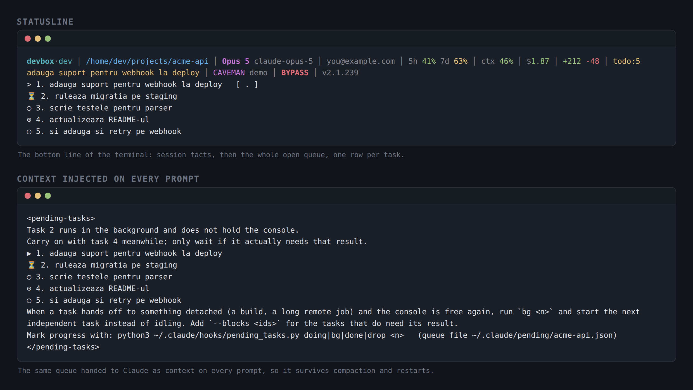

# Claude Task Manager

A pending-task queue for [Claude Code](https://claude.com/claude-code), living outside the
conversation.

You fire three asks in a row while a long job is running. Two of them scroll away, the context gets
compacted, and the session quietly forgets what you wanted. This keeps the queue in a file instead:
it survives compaction, a restart, and a second console open on the same project — and it is on
screen permanently, in the statusline, instead of buried in the transcript.



## What it does

- **Queues every prompt.** A `UserPromptSubmit` hook appends the prompt to the project's queue and
  hands the whole open queue back as context, so the assistant always sees what is still owed.
- **Splits multi-ask messages.** `1: … 2: …` or a bulleted list becomes one task per ask, so a
  three-ask message cannot be half-answered and forgotten. Prose that runs several asks together is
  caught by a background pass through a small model (marked `⊙` — worth a glance).
- **Folds a follow-up into the task it belongs to.** An ask that is really about work already on
  the board is appended to that task (the row shows `(+N)`) instead of opening a second half-task
  for one piece of work. Matching is on shared word stems, so inflection does not hide it.
- **Shows the whole board.** The statusline carries the count plus one row per open task, and a
  `>` row marks what to do next; typing a bare `.` accepts it. Rows are coloured by state — next
  yellow, in progress cyan, parked dim, just-finished green — carry a dim age once a task is over
  an hour old, and wrap to the real terminal width (`$COLUMNS`; `NO_COLOR` turns colour off,
  `$PENDING_BOARD_ROWS` sets how many rows the board takes).
- **Backgrounded work stops blocking.** `bg <n>` says a task is now waiting on something detached
  (a build, a long remote job): it stays open but drops out of the suggestion, so the console picks
  up the next task that does not need its result. `--blocks <ids>` holds back the ones that do.
- **An interactive board.** `tasks_tui.py` opens the queue in a curses TUI: arrow keys to move,
  `Enter` to pick a task, then start it now, background it, finish it or drop it.
- **One queue per project, per session under `$HOME`.** Nothing is ever copied between queues, so
  one console's board never shows another's work.

### Board markers

| mark | meaning |
|---|---|
| `>` | the one to do next; accepts a bare `.` |
| `▶` | in progress |
| `○` | pending, not started |
| `⊙` | pending, added by the prompt splitter |
| `⏳` | running in the background, not holding the console |
| `●` | just finished — the receipt stays until the next task starts or finishes |

## Install

```bash
git clone https://github.com/paunescumihai/claude-task-manager
cd claude-task-manager
./install.sh
```

It copies the hook files into `~/.claude/hooks/`, wires the `UserPromptSubmit` and `Stop` hooks
plus the statusline into `~/.claude/settings.json` (backing the file up first and keeping any hooks
you already have), and runs the test suite. Restart Claude Code afterwards.

Requires Python 3.8+ and Bash. No third-party packages.

## Use

```bash
python3 ~/.claude/hooks/pending_tasks.py list          # the queue
python3 ~/.claude/hooks/pending_tasks.py doing 3       # start item 3
python3 ~/.claude/hooks/pending_tasks.py bg 3 --blocks 5,6
python3 ~/.claude/hooks/pending_tasks.py done 3        # finish it
python3 ~/.claude/hooks/pending_tasks.py drop 3        # abandon it
python3 ~/.claude/hooks/pending_tasks.py add "text"    # queue by hand
python3 ~/.claude/hooks/pending_tasks.py step 3 "the concrete next action"
python3 ~/.claude/hooks/pending_tasks.py all           # every queue that still has open tasks
python3 ~/.claude/hooks/pending_tasks.py prune         # drop cold empty queues and dead pointers
python3 ~/.claude/hooks/tasks_tui.py                   # interactive board
```

`step` records what to actually do next rather than restating the task title; it is the line the
board offers for `.`.

## Where the state lives

`~/.claude/pending/<project-slug>.json`, one file per project. `$HOME` is a catch-all rather than a
project, so consoles started there get one queue each, keyed on the session id. A pointer file per
session tells a shell-invoked `done N` which queue it meant — ids are per-queue and are not unique
across projects, so a command never hunts for an id across files.

Cold queues with nothing open are pruned after a week.

## Files

| file | what it is |
|---|---|
| `hooks/pending_tasks.py` | the queue: hook entry points and the CLI |
| `hooks/statusline.sh` | statusline renderer — session facts on one line, the board underneath |
| `hooks/test_pending_tasks.py` | cross-session isolation, `bg` hand-over, board rendering |
| `hooks/tasks_tui.py` | interactive curses board: pick a task, act on it |
| `hooks/test_tasks_tui.py` | TUI rendering and key handling |
| `install.sh` | copies the files and wires `settings.json` |

## Tests

```bash
python3 hooks/test_pending_tasks.py
python3 hooks/test_tasks_tui.py
```

Runs against a throwaway `$HOME`; it never touches a real queue.
