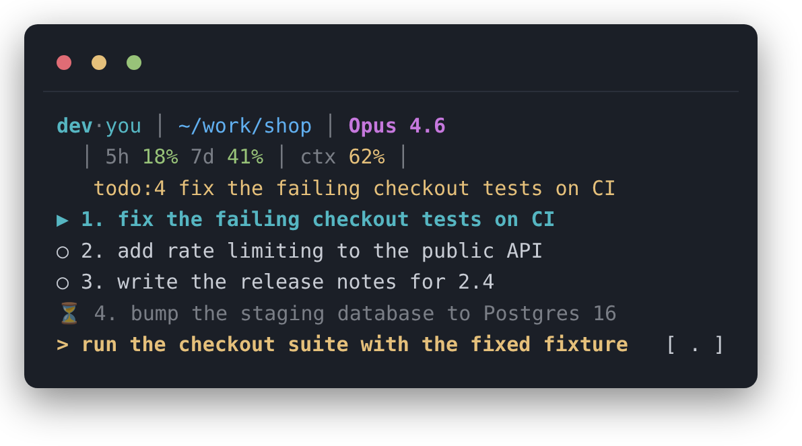
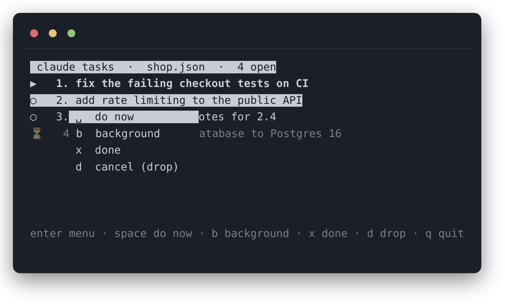
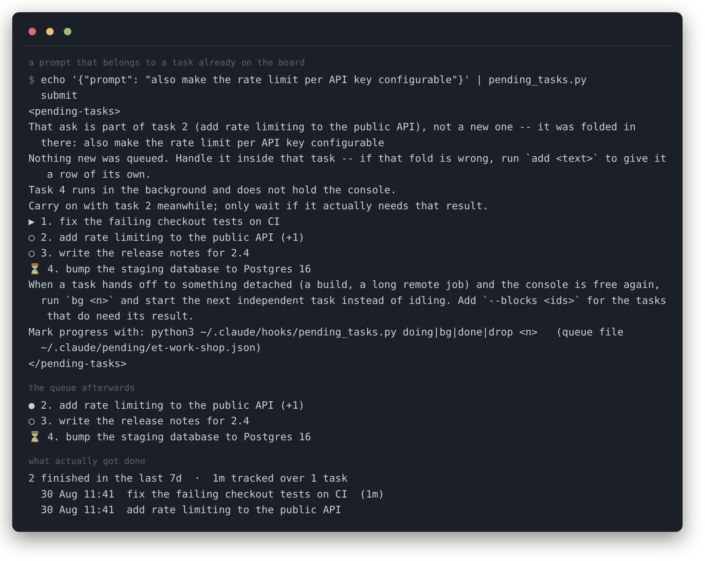

# Claude Task Manager — a persistent task queue for Claude Code

**Claude Code forgets what you asked for. This remembers.** A pending-task queue that lives in a
file, rides in the statusline, and is fed back into every prompt — so no ask is lost to a scrolled
transcript, a context compaction, or a restart.

[](LICENSE)
[](https://www.python.org/)
[](#install)
[](https://claude.com/claude-code)



Fire three asks while a long job runs. Two scroll away, the context gets compacted, and the session
quietly forgets. This keeps the queue in `~/.claude/pending/<project>.json` instead: it survives
compaction, a restart and a second console on the same project, and it is on screen permanently —
one row per open task, under the statusline.

- [Install](#install)
- [What it does](#what-it-does)
- [Board markers](#board-markers)
- [The interactive board](#the-interactive-board)
- [Merging a follow-up into the task it belongs to](#merging-a-follow-up-into-the-task-it-belongs-to)
- [Commands](#commands)
- [How it hooks in](#how-it-hooks-in)
- [Configuration](#configuration)
- [Where the state lives](#where-the-state-lives)
- [Tests](#tests)
- [FAQ](#faq)

## Install

```bash
git clone https://github.com/paunescumihai/claude-task-manager
cd claude-task-manager
./install.sh
```

Copies the hooks into `~/.claude/hooks/`, wires `UserPromptSubmit`, `Stop`, `SessionStart`,
`SessionEnd` and the statusline into `~/.claude/settings.json` (backing it up first and keeping the
hooks you already have), then runs the tests. Restart Claude Code afterwards.

Python 3.8+ and Bash. No third-party packages, no service, no daemon.

## What it does

| | |
|---|---|
| **Queues every prompt** | A `UserPromptSubmit` hook appends the prompt to the project's queue and hands the whole open queue back as context, so the assistant always sees what is still owed. |
| **Splits multi-ask messages** | `1: … 2: …` or a bulleted list becomes one task per ask, so a three-ask message cannot be half-answered and forgotten. Prose that runs several asks together is caught by a background pass through a small model (marked `⊙`). |
| **Folds follow-ups into their task** | An ask that is really about work already on the board is appended to that task — the row shows `(+N)` — instead of opening a second half-task for one piece of work. Matching is on shared word stems, so inflection does not hide it. |
| **Shows the whole board** | The statusline carries the count plus one row per open task, coloured by state, wrapped to the real terminal width. A `>` row proposes the next concrete step; typing a bare `.` accepts it. |
| **Stops blocking on background work** | `bg <n>` marks a task as waiting on something detached — a build, a long remote job. It stays open but drops out of the suggestion, so the console picks up the next task that does not need its result. `--blocks <ids>` holds back the ones that do. |
| **Gives you an interactive board** | `tasks_tui.py` opens the queue in a curses TUI: arrows or mouse to move, `Enter` for the row menu, then start / background / finish / drop. |
| **Picks up where the console left off** | `SessionStart` hands the open queue back when a console opens or resumes; `SessionEnd` stamps the queue; `all` flags boards whose session is gone but whose tasks are not. |
| **Undo, edit, and a record of what got done** | `undo` puts back the last task closed or dropped (5 deep), `edit N` rewords a task without losing its id, and `report` prints what actually finished, with the time tracked between `doing` and `done`. |
| **One queue per project** | Per session under `$HOME`, which is a catch-all rather than a project. Nothing is ever copied between queues, so one console's board never shows another's work. |

### Board markers

| mark | meaning |
|---|---|
| `>` | the one to do next; accepts a bare `.` |
| `▶` | in progress |
| `○` | pending, not started |
| `⊙` | pending, added by the prompt splitter — worth a glance |
| `⏳` | running in the background, not holding the console |
| `●` | just finished — the receipt stays until the next task starts or finishes |

Next is yellow, in progress cyan, background and parked dim, just-finished green. A task older than
an hour carries a dim age (`3h`, `2d`).

## The interactive board

```bash
python3 ~/.claude/hooks/tasks_tui.py
```



It polls the queue file, so anything a console or a hook does shows up here within a second, and
anything done here is picked up by the next prompt. Keys: `↑ ↓` / `j k` move, `Enter` opens the row
menu, `space` do now, `b` background, `x` done, `d` drop, `q` quit. Mouse and wheel work too.

## Merging a follow-up into the task it belongs to



## Commands

```bash
python3 ~/.claude/hooks/pending_tasks.py list           # the queue
python3 ~/.claude/hooks/pending_tasks.py board          # the queue as the statusline renders it
python3 ~/.claude/hooks/pending_tasks.py add "text"     # queue by hand
python3 ~/.claude/hooks/pending_tasks.py doing 3        # start item 3
python3 ~/.claude/hooks/pending_tasks.py step 3 "the concrete next action"
python3 ~/.claude/hooks/pending_tasks.py next           # what the `.` accept would run
python3 ~/.claude/hooks/pending_tasks.py bg 3 --blocks 5,6
python3 ~/.claude/hooks/pending_tasks.py done 3         # finish it
python3 ~/.claude/hooks/pending_tasks.py done 3 4 5     # close several at once
python3 ~/.claude/hooks/pending_tasks.py drop 3         # abandon it
python3 ~/.claude/hooks/pending_tasks.py edit 3 "text"  # reword item 3, same id
python3 ~/.claude/hooks/pending_tasks.py undo           # put back the last closed or dropped task
python3 ~/.claude/hooks/pending_tasks.py report 7       # what got finished in the last 7 days
python3 ~/.claude/hooks/pending_tasks.py down 1         # scroll, when there are more tasks than rows
python3 ~/.claude/hooks/pending_tasks.py all            # every queue that still has open tasks
python3 ~/.claude/hooks/pending_tasks.py prune          # drop cold empty queues and dead pointers
python3 ~/.claude/hooks/tasks_tui.py                    # interactive board
```

`step` records what to actually do next rather than restating the task title — it is the line the
board offers for `.`.

## How it hooks in

| hook | what it does |
|---|---|
| `UserPromptSubmit` | queues the prompt (splitting or merging it), prints the open queue back as context |
| `Stop` | continues the queue at the end of a turn and summarises what moved |
| `SessionStart` | hands the open queue to a console that just opened, resumed or compacted |
| `SessionEnd` | stamps the queue so `all` can flag a board nobody is watching |
| `statusLine` | renders the session line plus the board underneath it |

## Configuration

| variable | effect |
|---|---|
| `COLUMNS` | board width. Claude Code exports it; `statusline.sh` passes it through |
| `PENDING_BOARD_ROWS` | how many rows the board may take (default 5) |
| `NO_COLOR` | plain board, no ANSI |
| `CLAUDE_CONFIG_DIR` | where `pending/` lives (default `~/.claude`) |

`statusLine.refreshInterval` in `settings.json` controls how often the board re-renders on its own;
without it the statusline only redraws when the assistant answers, so changes made in the TUI stay
invisible until the next turn.

## Where the state lives

`~/.claude/pending/<project-slug>.json`, one file per project. A pointer file per session tells a
shell-invoked `done N` which queue it meant — ids are per-queue and not unique across projects, so
a command never hunts for an id across files. Cold queues with nothing open are pruned after a week.

| file | what it is |
|---|---|
| `hooks/pending_tasks.py` | the queue: hook entry points and the CLI |
| `hooks/statusline.sh` | statusline renderer — session facts on one line, the board underneath |
| `hooks/tasks_tui.py` | interactive curses board |
| `hooks/test_pending_tasks.py` | isolation, `bg` hand-over, merging, board rendering |
| `hooks/test_pending_next.py` | the `step` / `next` / `.` accept path |
| `hooks/test_tasks_tui.py` | TUI rendering and key handling |
| `docs/make-screenshots.py` | regenerates the screenshots above from a mock queue |
| `install.sh` | copies the files and wires `settings.json` |

## Tests

```bash
python3 hooks/test_pending_tasks.py
python3 hooks/test_pending_next.py
python3 hooks/test_tasks_tui.py
```

They run against a throwaway `$HOME`; a real queue is never touched.

## FAQ

**Does it work with plain Claude Code, no plugins?** Yes. Everything is hooks and one statusline
script, both of them documented Claude Code features.

**Does it send anything anywhere?** No. Local files only. The only optional network call is the
prompt splitter, which asks the Claude CLI you already have installed to split a compound prompt.

**Two consoles on one project?** They share that project's queue on purpose — that is the point.
Consoles started from `$HOME` get one queue each instead, since `$HOME` is not a project.

**Can I use the queue without the statusline?** Yes, `list`, `board` and the TUI all read the same
file; the statusline is one of several views.

**How do I get rid of it?** Delete the hook entries from `~/.claude/settings.json` (`install.sh`
leaves a timestamped backup) and remove `~/.claude/pending/`.

## License

MIT — see [LICENSE](LICENSE).

---

<sub>Keywords: Claude Code, Claude Code hooks, Claude Code statusline, Claude Code plugin, task
queue, todo list, pending tasks, backlog, AI coding agent, agent memory, context compaction,
UserPromptSubmit hook, SessionStart hook, curses TUI, Python, CLI task manager.</sub>
